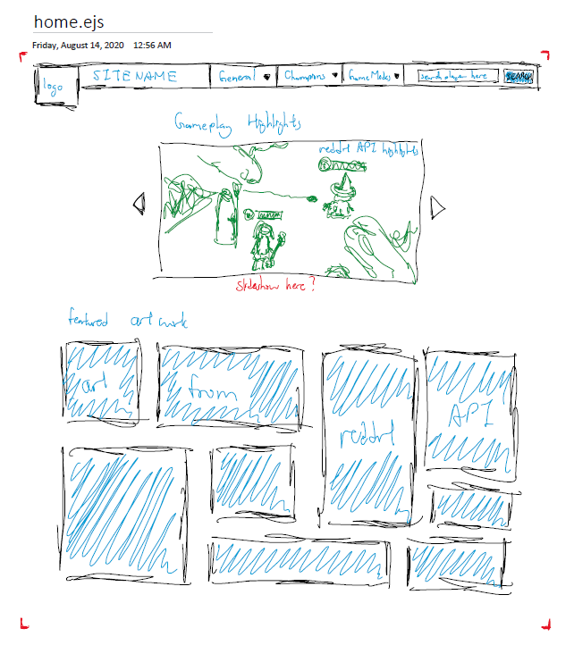
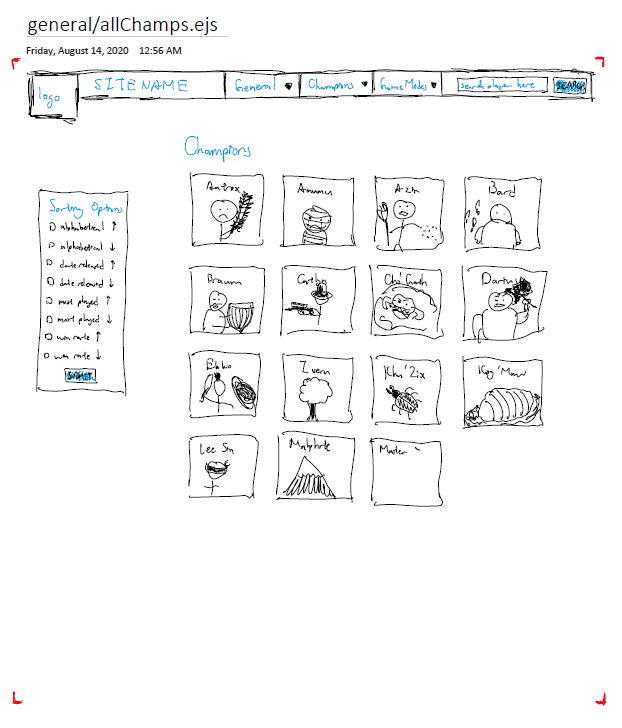
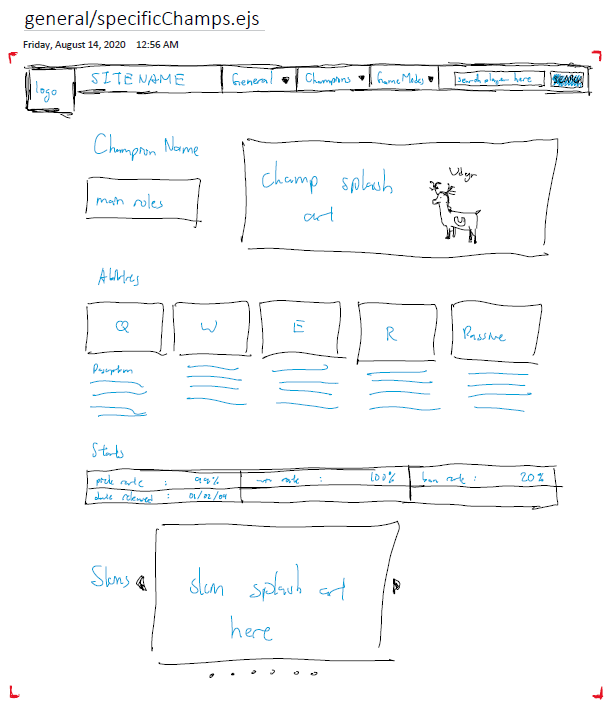
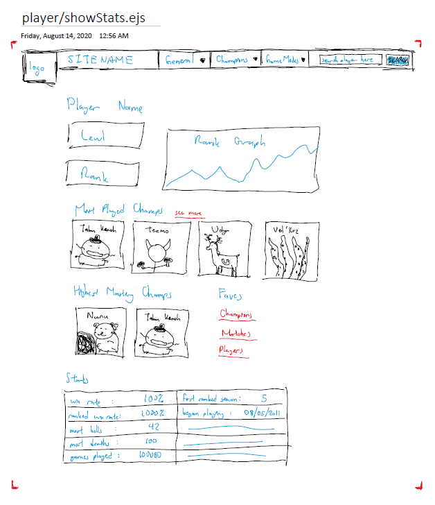

# Project 2 Planning

Fork & Clone this repo.

## Part 1

Review the [Project 2 requirements](https://tmdarneille.gitbook.io/sei-ga-sea/11-projects/project-2#project-feedback-evaluation) and check out some [examples](https://www.google.com/url?q=https://tmdarneille.gitbook.io/sei-ga-sea/11-projects/past-projects/project2&sa=D&source=calendar&ust=1597596784944000&usg=AOvVaw1ihTzKFunxKsL2f6sIYdlC).

In this space below, list **THREE** ideas for your Project 2. For each idea, include [user stories](https://revelry.co/user-stories-that-dont-suck/) for each idea and a link to the API(s) you want to use for it.

--------------------------------------------------------
1. Making a website that pulls stats from league of legends players and displays it
    - User will be able to enter a username and pull up a page of types of games played (ranked, unranked, special game modes)
    - Clicking on one of the categories will bring user to a new page with the number of games of that category played, win rate/lose rate, favorite champions, favorite roles, rank (for ranked only)
        - Clicking on a games played link will bring you to a list of the games that you have played (time stamped) with win or lose next to it, and champion played that game and position played
        - clicking on win rate and lose rate will bring you to a page that shows which roles are best for you, and which champions are best for you
        - clicking on the favorite champions link will bring you to a page of all the fav champs with links to pages of the champs with their abilities, lore, and overall stats (from other people who have played them)
    - For ranked, it will also show you the progress of your ranked climb (graph based off of increase in LP or decrease in LP)
2. Making a website that pulls specs and data on electronic devices (laptops, phones, tablets, and etc.) and allows you to compare them side by side
    - User will be able to navigate through a few different pages with all the different types of devices as the category. User will also be able to search up a device from a search bar (immediately display device name, stats on price, parent company, number of devices sold, and link to add device and show device)
        - user can add devices to a comparison widget or page and look at all the specs of all the devices side by side and compare them
            - better stats will be lit up in green
3. Making a website that takes your symptoms and give you the possible sicknesss that you have
    - User has the option to click checkboxes with common symptoms or type in symptoms
        - User will receive a page full of possible diseases from most matches to least matches
            - User can click on diseases and look at description, other symptoms, causes, treatment, etc...
---------------------------------------------------------

Make a PR when you're done!

---

## Part 2

In the space below:
* either embed or link a completed ERD for your approved P2 idea
* if there are any changes/additions to your user stories, place your full set of revised user stories here
* either embed or link wireframes for every page of your app

----------------------------------------------------------
### ERD
Link: https://drive.google.com/file/d/11LEb-omNQcTzm9VshVkEJlodRLQwnbty/view?usp=sharing

----------------------------------------------------------
### User Stories
API for League of Legends: https://developer.riotgames.com/apis
- Commiting to Project Idea #1 
    - Scope limitation: can add or remove number of pages being done and amount of data being added based off of amount of time available

----------------------------------------------------------
### Wireframes
Some of the wireframes (took me way too long to make these):
- 
- 
- 
- 

----------------------------------------------------------

Make a PR when you're done!
