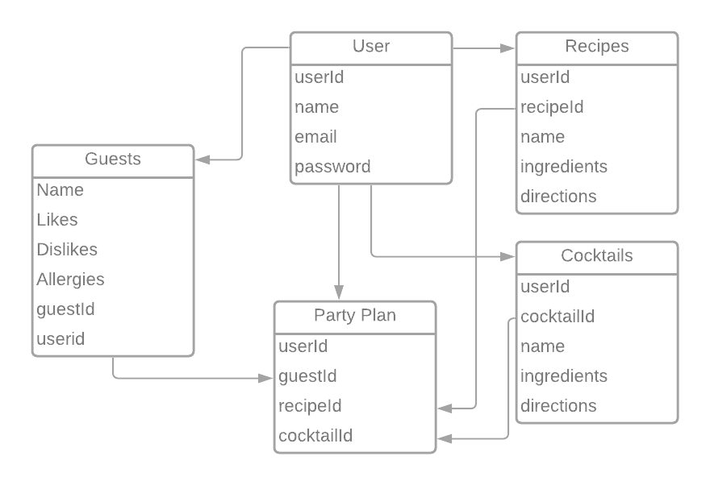
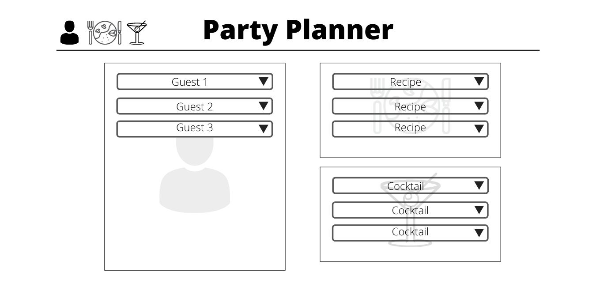
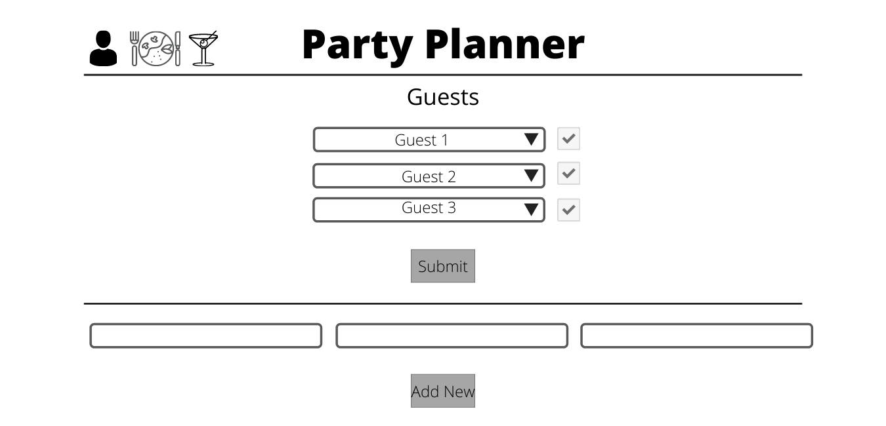
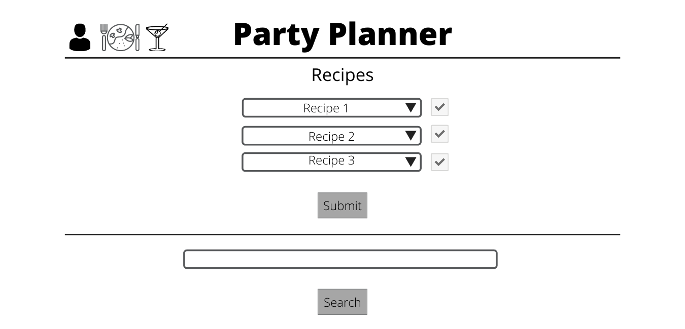
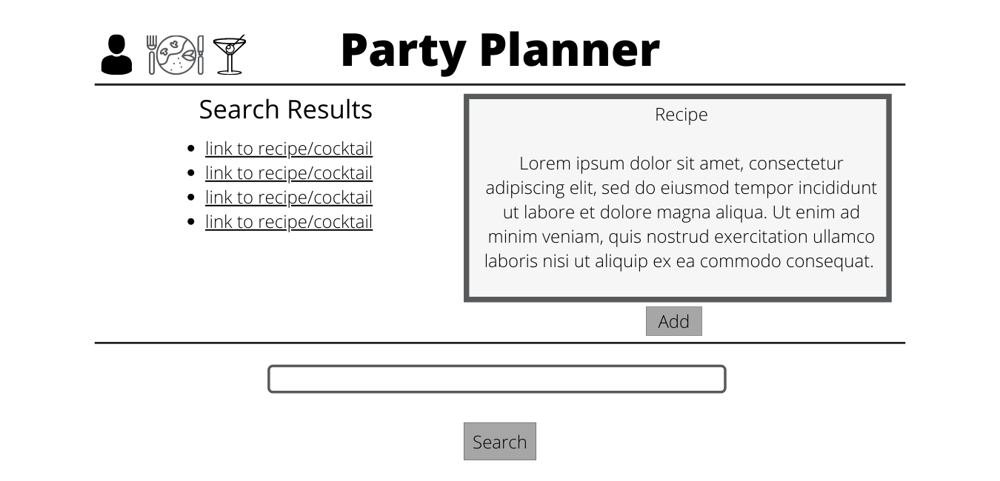

# Project 2 Planning

* Fork & Clone this repo.

Review the [Project 2 requirements](https://tmdarneille.gitbook.io/seirfx/11-projects/project-2#project-feedback-evaluation) and check out some [examples](https://tmdarneille.gitbook.io/seirfx/11-projects/past-projects/project2).

In the space below:
* either embed or link a completed ERD for your P2 idea
* include [user stories](https://revelry.co/user-stories-that-dont-suck/)
* either embed or link wireframes for every page of your app
* include links to any APIs or other 3rd party tech you plan to use
----------------------------------------------------------
### ERD

----------------------------------------------------------
### User Stories
* As a user, I want to be able to search for food and cocktail recipes
* As a user, I want to search for recipes and save them to a list in order to access them later
* As a user, I want to add guests to a list and include likes, dislikes, and/or sensitivities/allergies
* As a user I want to flag saved guests and recipes to be displayed together on one page, and then go to that page to see my party plan.
----------------------------------------------------------
### Wireframes

------------------------------

-------------------------------

---------------------------------

-----------------------------------

----------------------------------------------------------
### APIs and other outside tech

* [spoonacular api](https://spoonacular.com/food-api)
* [thecocktaildb api](https://www.thecocktaildb.com/api.php)

----------------------------------------------------------

Make a PR when you're done and title it with your pod person's name and yours (eg. "Edward<-->Taylor")!

