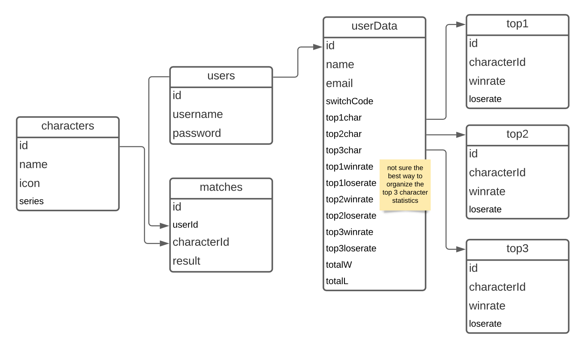

# Project 2 Planning

* Fork & Clone this repo.

Review the [Project 2 requirements](https://tmdarneille.gitbook.io/seirfx/11-projects/project-2#project-feedback-evaluation) and check out some [examples](https://tmdarneille.gitbook.io/seirfx/11-projects/past-projects/project2).

In the space below:
* either embed or link a completed ERD for your P2 idea
* include [user stories](https://revelry.co/user-stories-that-dont-suck/)
* either embed or link wireframes for every page of your app
* include links to any APIs or other 3rd party tech you plan to use

----------------------------------------------------------
## ERD

* A user can only have one user data.
* A user's data can only have one top 1 character.
* A user's data can only have one top 2 character.
* A user's data can only have one top 3 character.
* A top 1 character can only belong to one user's data.
* A top 2 character can only belong to one user's data.
* A top 3 character can only belong to one user's data.
* A user can have many matches.
* A match can only have one user.
* A match can only have one character.
* A character can have many matches.

----------------------------------------------------------
## User Stories

1. As a user, I want to create a profile for my Super Smash Bros matches.
2. As a user, I want to select the characters I played.
3. As a user, I want to track my wins and losses with certain characters.
4. As a user, I want to view my match history.
5. As a user, I want to see the percentage of wins on my top characters.

----------------------------------------------------------
## Wireframes

**The above wireframe is specific to a user's profile page.** 

*Other pages will have simpler body content.*
* Home
* Character - *shows list of all characters*
* Character/:id - *shows info on one character*
* User Profile - *based on :userId or :username
* About
* Feedback/Contact
* Privacy Policy *(not sure if this would be needed?)*
* Social Media Links (Discord, GitHub)

----------------------------------------------------------
## APIs and other outside tech

[Unofficial API for Super Smash Bros](https://smashbros-unofficial-api.vercel.app/)

[Sample of SSB API Data](https://smashbros-unofficial-api.vercel.app/api/v1/ultimate/characters)

----------------------------------------------------------
