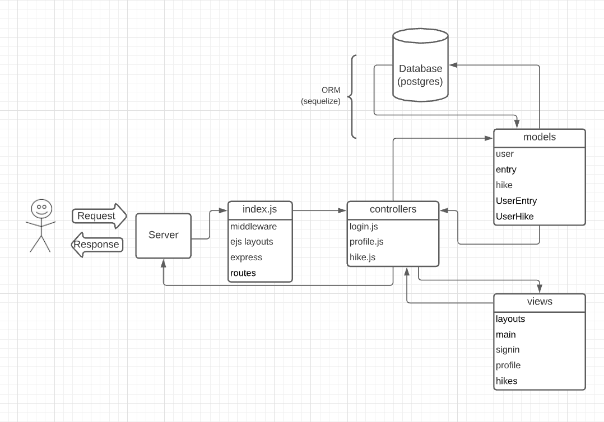
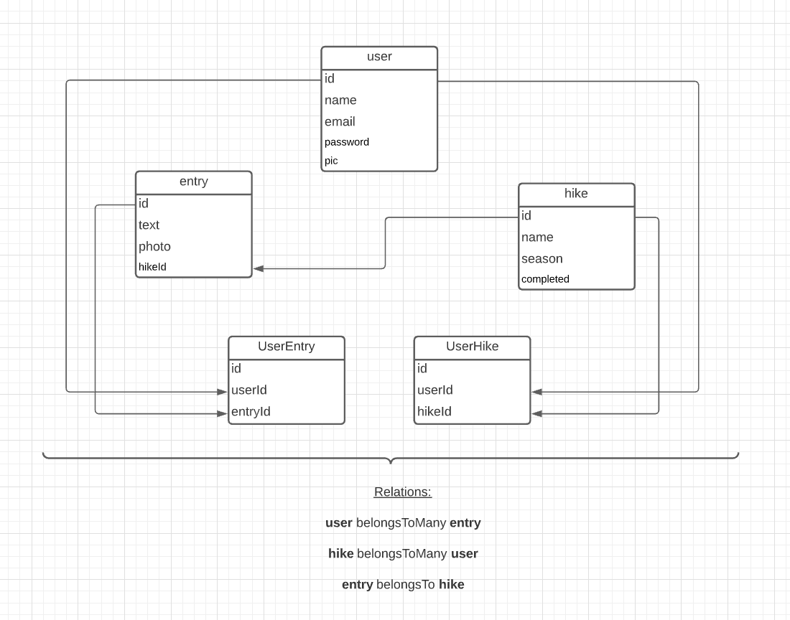
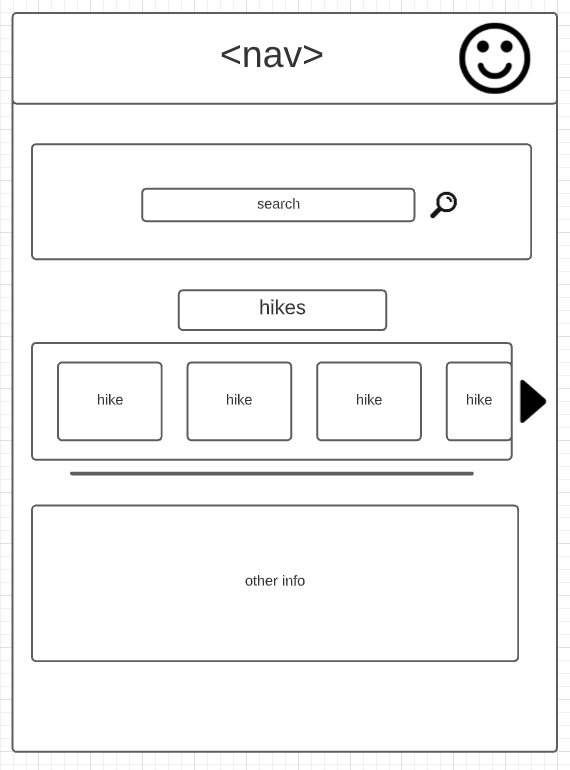
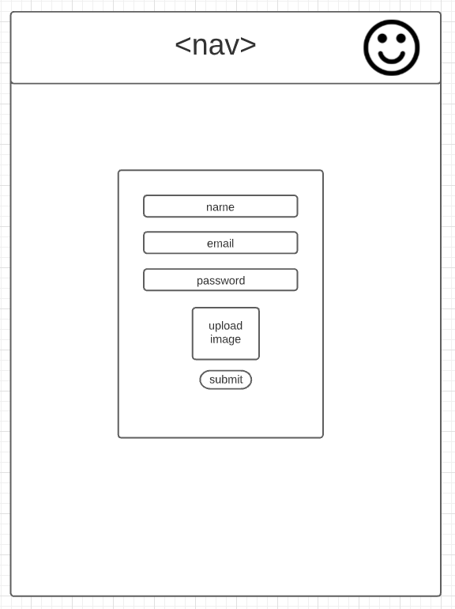
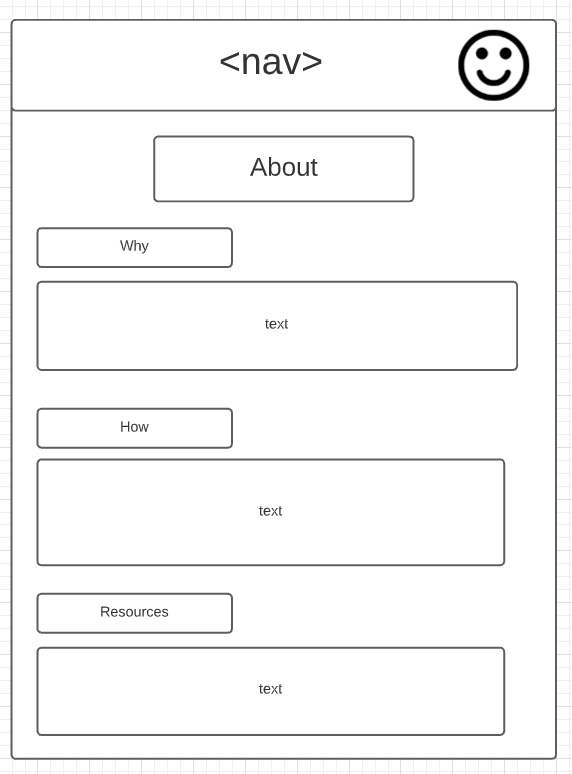
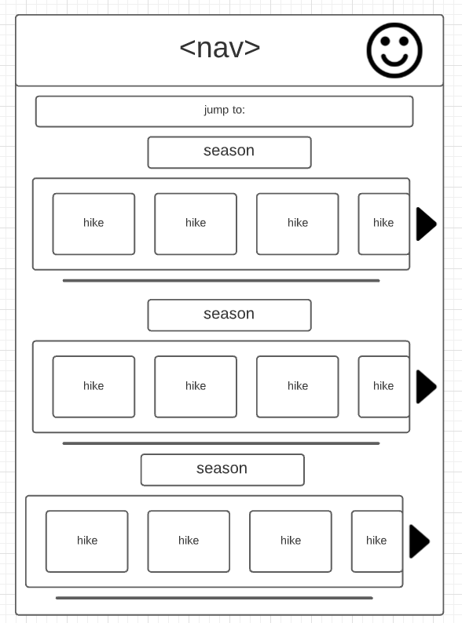
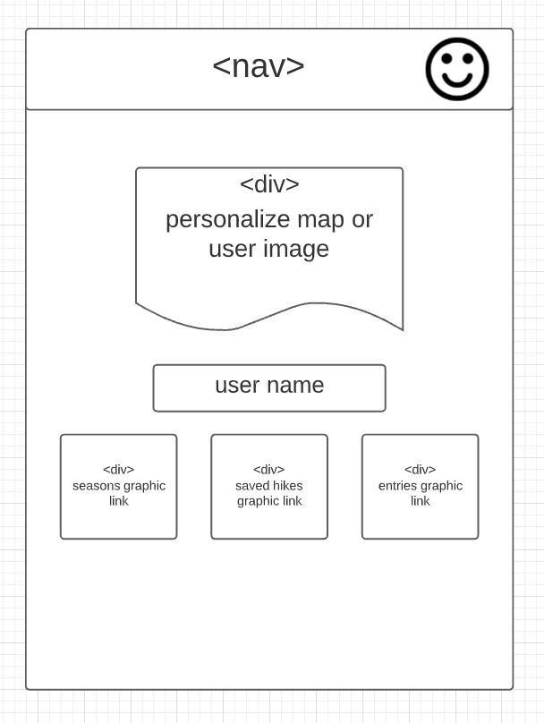
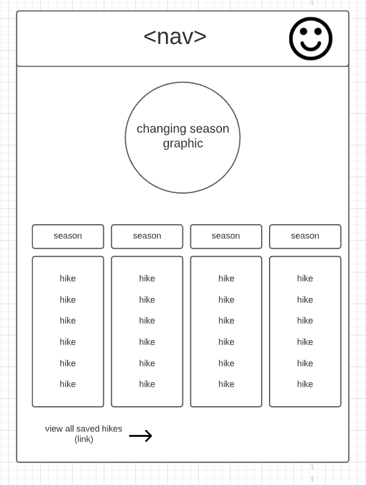
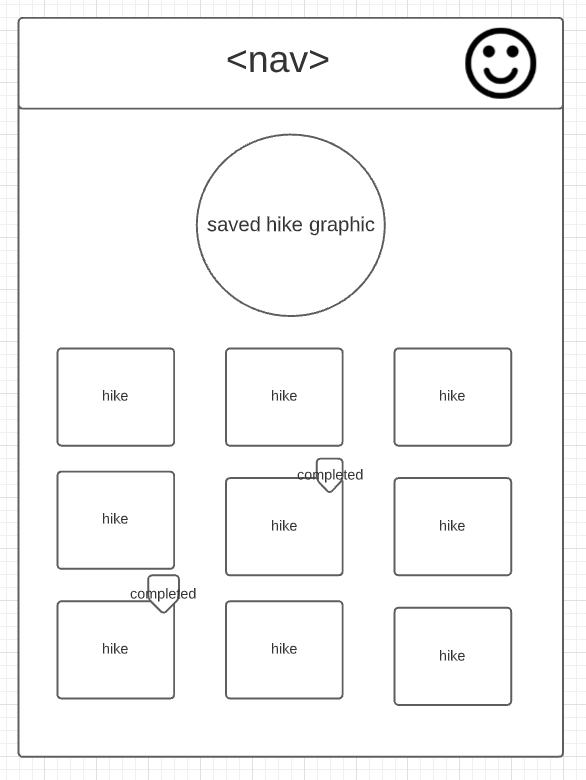
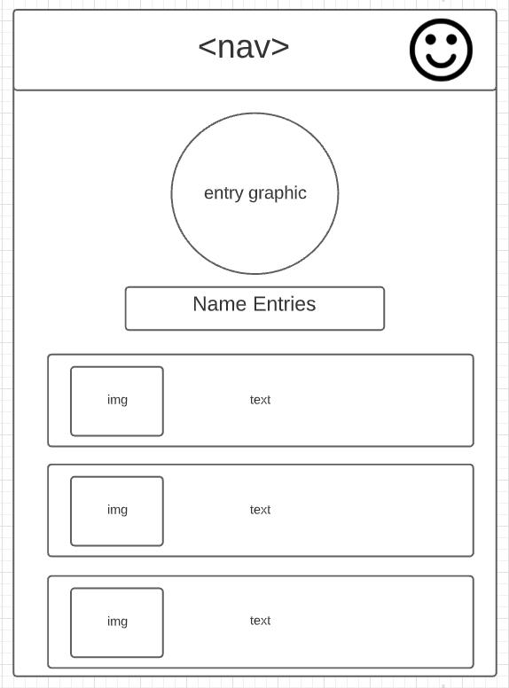

# Project 2 Planning

* Fork & Clone this repo.

Review the [Project 2 requirements](https://tmdarneille.gitbook.io/seirfx/11-projects/project-2#project-feedback-evaluation) and check out some [examples](https://tmdarneille.gitbook.io/seirfx/11-projects/past-projects/project2).

In the space below:
* either embed or link a completed ERD for your P2 idea
* include [user stories](https://revelry.co/user-stories-that-dont-suck/)
* either embed or link wireframes for every page of your app
* include links to any APIs or other 3rd party tech you plan to use

----------------------------------------------------------
### ERD

<!-- 
 -->

----------------------------------------------------------
### User Stories
 I'm creating this app for people like me who might not be in touch with weather conditions when it comes to mountain tops. I want this app to direct users to chose hikes depending on which is the best season to visit; directly correlated to the altitude of a given hike. The app should allow users to bookmark hikes they'd like to do and also let them post entires/hopefully images too, that is related to a specific hike. User will be able to view a personal seasonal calendar filled with their bookmarked hikes in their respective season. User can also update the completed status of a saved hike. 

    Side Note: I moved to WA state beginning of September for the purpose of escaping the East Coast cold and being close to top tier nature. Now that I'm here, I realized that it is really cold, even snowy, on a lot of these hikes I go on, which was unexpected to me. It's not even winter. 
----------------------------------------------------------
### Wireframes

----------------------------------------------------------
### APIs and other outside tech

* Data scrape options: 
    * https://www.wta.org/go-outside/hikes
    * https://www.gardenguides.com/12428538-dawn-redwood-lumber-uses.html
* API options: 
    * https://rapidapi.com/trailapi/api/trailapi?endpoint=53aa3bd0e4b008bb2ef85a53
    * https://docs.trefle.io/

----------------------------------------------------------

Make a PR when you're done and title it with your pod person's name and yours (eg. "Edward<-->Taylor")!

----------------------------------------------------------

# Project 2 Requirements: 
* sign up/login functionality 
* at least 2 models 
    * user model and then 2 more 
* one third-party API
* CRUD/RESTful routing
    * get, post, put, delete 
* use ORM 
    * sequelize/postgres data tables
* readme file
    * explain how to use your app 
        * API keys/ environment variables 

----------------------------------------------------------

### Desired Extras:
 * For fall specifically, I wanted to try and determine hikes by region where certain trees grow so trees that have a tendency to change color can be placed in the fall section
    * has an added marker and specific month 
* for spring specifically, hikes with certain blooming tendencies
    * has an added marker and specific month
* Would also like to implement an editable map that marks a place they've been
    * google My Maps can do that but I don't know how to do that for each specific user
----------------------------------------------------------

