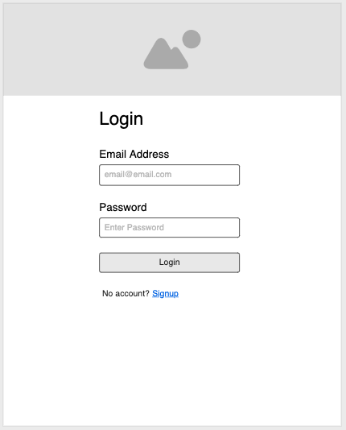

# Project 2 Planning

* Fork & Clone this repo.

Review the [Project 2 requirements](https://tmdarneille.gitbook.io/seirfx/11-projects/project-2#project-feedback-evaluation) and check out some [examples](https://tmdarneille.gitbook.io/seirfx/11-projects/past-projects/project2).

In the space below:
* either embed or link a completed ERD for your P2 idea
* include [user stories](https://revelry.co/user-stories-that-dont-suck/)
* either embed or link wireframes for every page of your app
* include links to any APIs or other 3rd party tech you plan to use

----------------------------------------------------------
### ERD
Link to ERD:  https://lucid.app/invitations/accept/e7cf2324-2f07-4b63-81dd-fef412a6b853

----------------------------------------------------------
### User Stories

1. As a user I want to signup for a profile to login to app in the future
2. In my account I want to search for games 
    - I want the list of results to show a thumbnail, name, genre and max/min of players
3. I want to be able to see the name, picture and descripiton of each game I select
4. I want to be able to save games to my library 
    - Each game in user library has a field to add a review
    - Each item in library or review made by user can be deleted

----------------------------------------------------------
### Wireframes

- Link to moqups.com project file: https://app.moqups.com/N4V73NSBci/view/page/a487ec24a

----------------------------------------------------------
### APIs and other outside tech

 - Link to API docs: https://www.boardgameatlas.com/api/docs

----------------------------------------------------------

Make a PR when you're done and title it with your pod person's name and yours (eg. "Edward<-->Taylor")!
