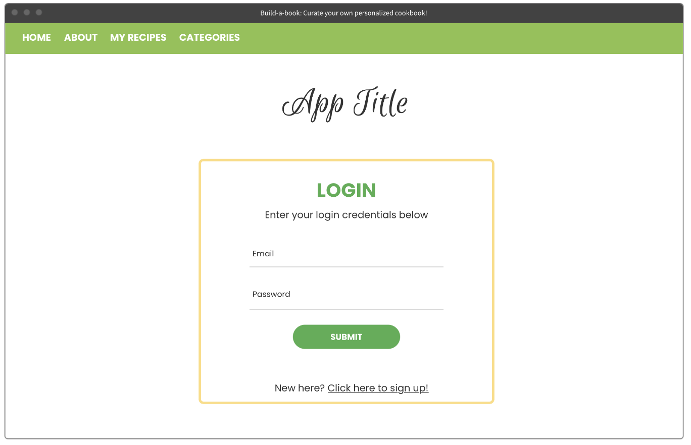

# Project 2 Planning

* Fork & Clone this repo.

Review the [Project 2 requirements](https://tmdarneille.gitbook.io/seirfx/11-projects/project-2#project-feedback-evaluation) and check out some [examples](https://tmdarneille.gitbook.io/seirfx/11-projects/past-projects/project2).

In the space below:
* either embed or link a completed ERD for your P2 idea
* include [user stories](https://revelry.co/user-stories-that-dont-suck/)
* either embed or link wireframes for every page of your app
* include links to any APIs or other 3rd party tech you plan to use

----------------------------------------------------------

## Overview

This app will allow users to view recipes and create their own recipes to build out a personalized cookbook of favorite recipes. They'll be able to edit their own created recipes and delete recipes from their cookbook.

----------------------------------------------------------
### ERD

----------------------------------------------------------
### User Stories

----------------------------------------------------------
### Wireframes

\
\
\
\
\
\

----------------------------------------------------------
### APIs and other outside tech

----------------------------------------------------------

Make a PR when you're done and title it with your pod person's name and yours (eg. "Edward<-->Taylor")!
